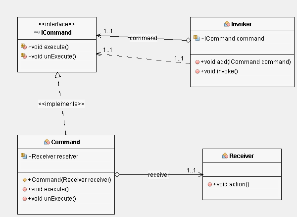

# Command Pattern

## Class Diagram

## Following are the pain points if command pattern is not used
***
* Performing many actions and undoing them will be very easy
* Performing actions via proxy, so it will be easy to add new actions
