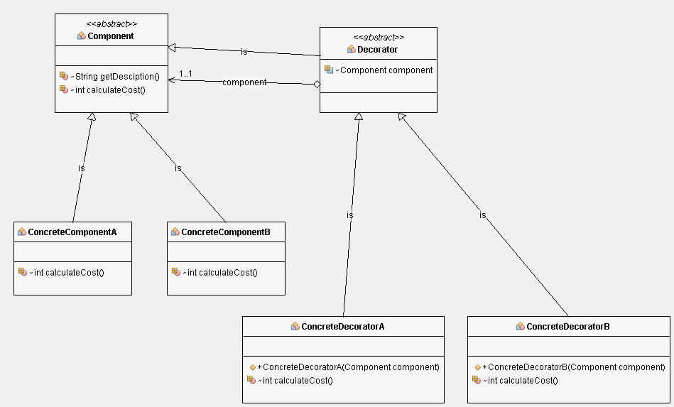

# Decorator Pattern

## Class Diagram

## Following are the pain points if decorator pattern is not used
***
* [Class explosion may happen. Because if many combinations need to be created
then that many subclasses need to be created]
* [Can create as many combinations without changing existing class]
* [Can go with boolean variables for all combinations, but again that is not
good idea for going with OOP's]
