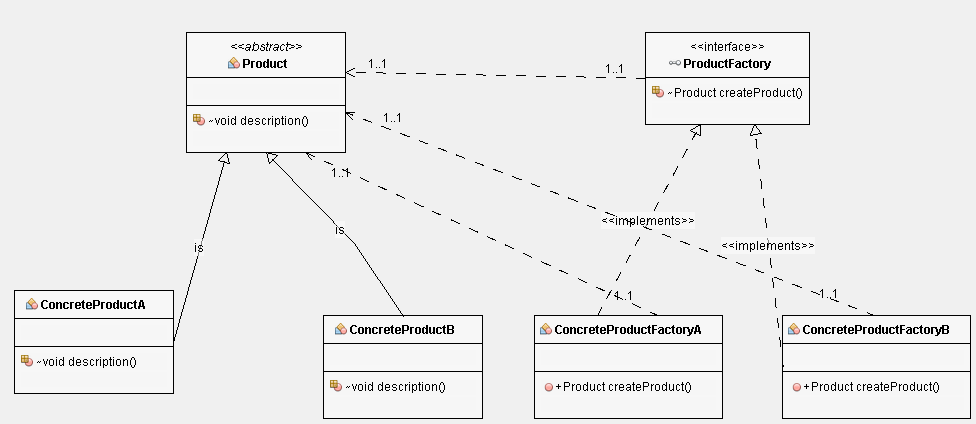

# Decorator Pattern

## Class Diagram

## Following are the pain points if factory pattern is not used
***
* class explosion
* All class creation logic based on some creation logic will be in one place