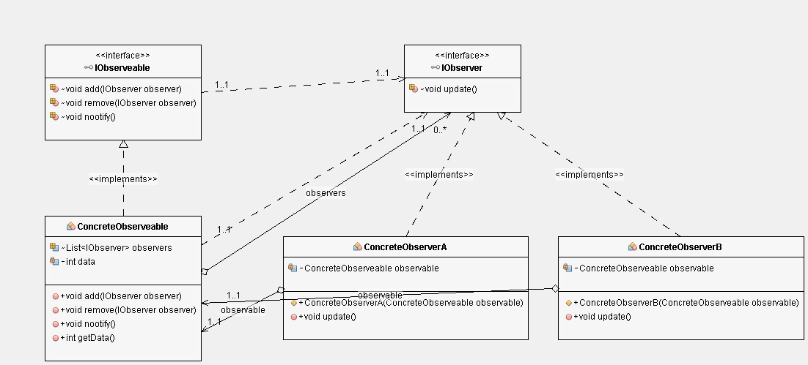

# Decorator Pattern

## Class Diagram

## Following are the pain points if observer pattern is not used
***
* Observer should always ask Observeable for any update
* If many observeables are there, then all should ask for each time to
Observer about update which will kill cpu time and update may be delayed because
of sleeping
